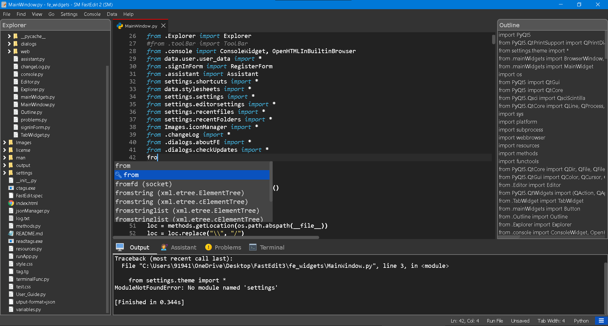

# SM FastEdit2
A fast and advanced text editor only for most popular languages. It was created by Shaurya Mishra.

<b>Note:</b> Images may not be clear.

## Supported Languages
FastEdit has support for some most used languages. HTML, CSS, JavaScript, JSON and Python are supported.
### HTML (Hyper Text Markup Language)
  
  <li>Smart autocompletion for HTML.</li>
  <li>Magic typing feature for HTML using regular expressions.</li>
  <li>Smart syntax colourization with eye relaxing colours.</li>
  <li>Built in browser support for testing HTML files.</li>
  <li>Code folding supported</li>
  
### CSS (Cascading Style Sheets)
  
  <li>Smart autocompletion with different icons for kywords, properties and values.</li>
  <li>Type ':' it will insert ' ;'(Magic Typing)</li>
  <li>Smart syntax colourization with eye relaxing colours.</li>
  <li>Code folding supported</li>
  <li>Large api to support autocompletions and calltips for CSS.</li>
  
### Python (Programming Language)
  
  <li>Smart autocompletion with different icons for kywords and methods.</li>
  <li>Magic typing feature for Python using regular expressions.</li>
  <li>Large api to support autocompletions and calltips for Python.</li>
  <li>Built in console window to run and debug python file.</li>
  <li>Outline supported for Python.</li>
  <li>Smart syntax highlighting with different colors for keywords, class name, method name ,operators, etc.</li>
  <li>Syntax highlighting support for interpreter, called terminal in FastEdit.</li>
